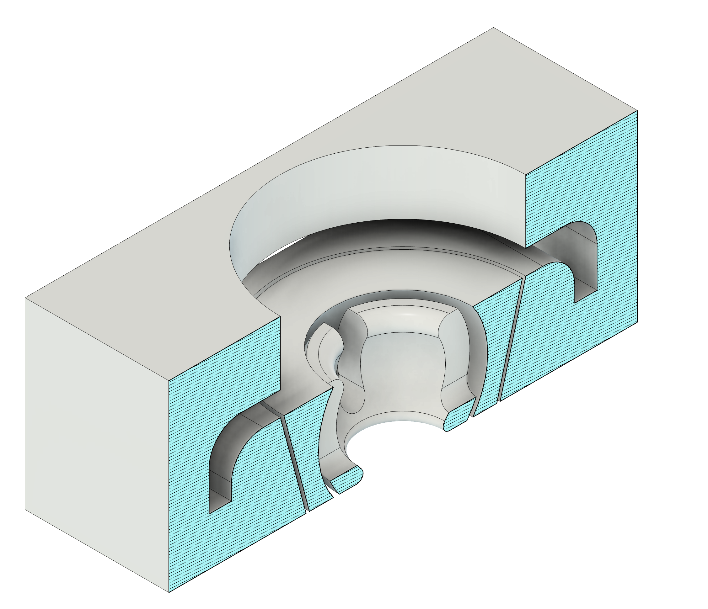

# VW Golf 2 (MK2) - 3D Druck Ersatzteile & Verbesserungen

Willkommen im Repository für DIY-Ersatzteile des VW Golf 2.

## Über das Projekt

Der Volkswagen Golf 2 ist mittlerweile über 30 Jahre alt und hat sich den Status eines echten Klassikers verdient. Doch mit dem Alter kommt ein Problem: Die Verfügbarkeit von Original-Ersatzteilen nimmt stetig ab. Viele kleine Kunststoffteile sind "Entfallen ohne Ersatz" (EOE) oder nur noch zu horrenden Preisen als "New Old Stock" verfügbar.

**Dieses Projekt hat folgende Ziele:**
*   **Erhaltung:** Wir wollen den Golf 2 auf der Straße halten, indem wir nicht mehr lieferbare Teile durch 3D-Druck reproduzierbar machen.
*   **Optimierung:** Wo das Original Schwächen hatte (z.B. Sollbruchstellen), versuchen wir, das Design zu verbessern.
*   **Open Source:** Alle Dateien stehen unter der MIT-Lizenz zur Verfügung und dienen als Quelle für andere 3D-Modell-Plattformen (wie Thingiverse, Printables, etc.).

---

## Wichtiger Haftungsausschluss (Disclaimer)

**Bitte aufmerksam lesen:**

Die Bereitstellung dieser 3D-Modelle und Anleitungen erfolgt ohne Gewährleistung.
*   **Verantwortung:** Die Herstellung, der Einbau und die Verwendung der hier bereitgestellten Teile erfolgen **ausschließlich auf eigene Gefahr und Verantwortung des Nutzers**.
*   **Sicherheit:** Teile, die sicherheitsrelevant sind (z.B. Bremse, Lenkung, Fahrwerk), sollten niemals leichtfertig durch selbstgedruckte Teile ersetzt werden.
*   **Rechtliches:** Der Nutzer ist selbst dafür verantwortlich zu prüfen, ob der Einsatz der Teile im öffentlichen Straßenverkehr zulässig ist (StVZO Konformität).

Die Ersteller dieses Projekts haften nicht für Schäden am Fahrzeug, Personen oder Dritten, die durch die Nutzung dieser Designs entstehen.

---

## Die Bauteile

Hier findest du eine Übersicht der aktuell verfügbaren Teile in diesem Repository.

### 1. Scheinwerferhalterung (Headlight Adjuster/Mount)

Die originale Halterung der Scheinwerfer ist eine bekannte Schwachstelle beim Golf 2.

#### Das Problem beim Original
*   **Materialermüdung:** Der Weichmacher im Kunststoff ist über die Jahrzehnte entwichen, was das Material extrem spröde macht.
*   **Filigranes Design:** Die originalen Clips brechen oft schon beim Versuch, den Scheinwerfer einzustellen oder auszubauen.
*   **Verfügbarkeit:** Einzeln kaum noch zu bekommen, oft muss ein kompletter Scheinwerfer gekauft werden.

#### Das neue Design (Verbesserung)

Unser Redesign geht das Problem strukturell an:
*   **Zweiteiliger Aufbau:** Das Bauteil wurde in zwei Komponenten getrennt:
    1.  Die **Kugelkopfhalterung** (für die Verstellschraube).
    2.  Die **Befestigung** am Scheinwerferrahmen selbst.
*   **Vorteil:** Durch die Trennung können die Teile stabiler gedruckt werden und lassen sich bei einem Defekt einzeln tauschen, ohne den ganzen Mechanismus zu ersetzen.

#### Druckempfehlung
Da dieses Bauteil im Motorraum bzw. direkt am heißen Scheinwerfer sitzt und potenziell Sonnenlicht ausgesetzt ist, sind PLA oder einfaches PETG hier **nicht** ausreichend.

*   **Empfohlenes Material:** ABS oder ASA (Acrylnitril-Styrol-Acrylat).
*   **Eigenschaften:** Diese Materialien sind hitzebeständig (wichtig durch die Abwärme der Leuchtmittel) und UV-beständig (wichtig gegen Versprödung durch Sonne).
*   **Infill:** Mindestens 40% bis 100% für maximale Stabilität.

---

## Mitwirken (Contributing)

Hast du eigene Designs für den Golf 2 entworfen oder Verbesserungen für die bestehenden Teile? Pull Requests sind herzlich willkommen! Bitte stelle sicher, dass du deine CAD-Dateien (z.B. STEP) sowie die druckbaren STLs bereitstellst.

## Lizenz

Dieses Projekt ist unter der **MIT Lizenz** veröffentlicht.
Das bedeutet, du darfst die Dateien frei verwenden, verändern und verbreiten, solange der ursprüngliche Urheberrechtsvermerk erhalten bleibt. Siehe `LICENSE` Datei für Details.
